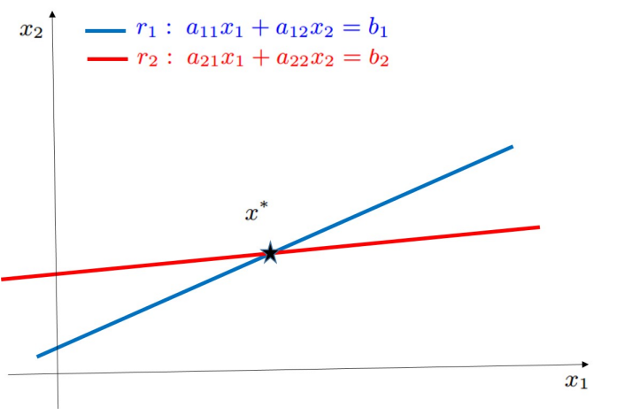

# Sistemi Lineari

## Definizione del problema

Data una matrice $A \in \mathbb R^{n \times n}$, detta matrice dei coefficienti, e il termine noto $b \in \mathbb R^{n}$

$$
A = \begin{pmatrix}
a_{11} & a_{12} & \dots & a_{1n} \\
a_{21} & a_{22} & \dots & a_{2n} \\
\vdots \\
a_{n1} & a_{n2} & \dots & a_{nn} \\
\end{pmatrix}
\quad
b = \begin{pmatrix}
b_1 \\
b_2 \\
\vdots \\
b_n
\end{pmatrix}
$$

si vuole calcolare il vettore $x \in \mathbb R^n$ che soddisfa l’uguaglianza $Ax=b$

In forma esplicita:

$$
\begin{cases}\begin{aligned}
a_{11}x_1 + a_{12}x_2 + \dots + a_{1n}x_n &= b_1 \\
a_{21}x_1 + a_{22}x_2 + \dots + a_{2n}x_n &= b_2 \\
&\vdots \\
a_{n1}x_1 + a_{n2}x_2 + \dots + a_{nn}x_n &= b_n \\
\end{aligned}\end{cases}
$$

## Risultati di esistenza e unicità

### Definizione di nonsingolarità

Una matrice $A \in \mathbb R^{n\times n}$ si dice nonsingolare (o invertibile) se esiste una matrice $X$ tale che $AX = XA = I$.

La matrice $X$ si dice *inversa* di $A$ e si indica come  $X = A^{-1}$

Una conseguenza di questa definizione è la seguente proposizione

### Proposizione

Le seguenti proprietà sono equivalenti:

- $A$ è nonsingolare
- $\det{(A)} \ne 0$
- righe e colonne di $A$ formano un insieme di vettori linearmente indipendenti
- $Ax = 0 \Leftrightarrow x =0$

E il seguente teorema

### Teorema di Rouchè-Capelli

Se $A$ è non singolare allora esiste un’unica soluzione del sistema lineare $Ax=b$

## Condizionamento

Un sistema lineare si dice malcondizionato quando le equazioni del sistema lineare (quindi le righe) sono “*quasi”* linearmente dipendenti ossia quando non è “quasi” soddisfatta la condizione di non-singolarità.

### Interpretazione grafica

Se $n=2$ la soluzione di un sistema consiste nel punto $x^*$ in cui intersecano le rette $r_1$ e $r_2$ di equazione $a_{11}x_{1}+a_{12}x_2=b_1$  e $a_{21}x_1 +a_{22}x_2 =b_2$ rispettivamente. 

Il caso di malcondizionamento si ha quando $r_1$ ed $r_2$ sono ‘quasi’ coincidenti.

Occorre studiare come variano le soluzioni rispetto a perturbazioni $\Delta b$ sui dati che sono $A,b$

Definendo

- $x^*$ → soluzione di $Ax=b$
- $\tilde{x}$ → soluzione di $Ax=b + \Delta b$

L’obiettivo è ricavare una relazione (espressa da un parametro) tra l’errore relativo sulle soluzioni e l’errore relativo sui dati

$$
\frac{\lVert x^* -\tilde x \lVert}{\lVert x^* \lVert} = \Box  \frac{\lVert \Delta b \lVert}{\lVert b \lVert}
$$

dove $\Box$ è il parametro che vogliamo identificare.

## Numero o indice di condizionamento

### 📜Dimostrazione

**Ipotesi** → $Ax^* = b$ $\qquad A \tilde x = b + \Delta b \space (b \ne 0)$

### **Osservazione 1**

Al posto di $b$ nella seconda ipotesi vado a sostituire $Ax^*$ e ottengo 
$A \tilde x = Ax^* + \Delta b$

Raccolgo $A$ → $A (\tilde x - x^*) = \Delta b$, moltiplico a sinistra di ogni membro per $A^{-1}$:

$$
(\tilde x - x^*) = A^{-1} \Delta b
$$

Applico una norma da entrambi i lati

$$
\Vert \tilde{x}-x^* \Vert = \Vert A^{-1}*\Delta b\Vert \leq \Vert A^{-1}\Vert * \Vert\Delta b\Vert
$$

### **Osservazione 2**

Prendiamo la prima ipotesi e passiamo alla norma:

$$
b = Ax^* \Rightarrow \lVert b \lVert = \lVert Ax^* \lVert
$$

Applico la [proprietà submoltiplicativa](Norme%20vettoriali%20e%20matriciali%20c2013a0b8b284b44adb38a6b6d122217.md) ed ottengo:

$$
\lVert b \lVert \le \lVert A \lVert \cdot \lVert x^* \lVert
\; \Rightarrow \; \frac{1}{\lVert x^* \lVert} \le \frac{\lVert A \lVert }{\lVert b \lVert}
$$

### Unione delle due osservazioni

Sfruttiamo l’osservazione 1 e cerchiamo di trasformare l’errore relativo sulle soluzioni:

$$
\frac{\lVert  \tilde x - x^* \lVert}{\lVert x^* \lVert} = \frac{\lVert A^{-1} \Delta b \lVert}{\lVert x^* \lVert}
$$

Applico la [proprietà submoltiplicativa](Norme%20vettoriali%20e%20matriciali%20c2013a0b8b284b44adb38a6b6d122217.md) e sfruttiamo l’osservazione 2 

$$
\frac{\lVert A^{-1} \Delta b \lVert}{\lVert x^* \lVert} 
\le 
\frac{1}{\lVert x^* \lVert} \lVert A^{-1} \lVert \cdot \lVert \Delta b \lVert 
\le
\lVert A \lVert \cdot \lVert A^{-1} \lVert \cdot \frac{\lVert \Delta b\lVert }{\lVert b \lVert }
$$

Quindi il valore $k(A) = \lVert A \lVert \cdot \lVert A^{-1} \lVert$ prende il nome di **numero di condizionamento (o coefficiente di amplificazione)** della matrice $A$

NB: se il numero di condizionamento risulta essere pari ad 1 l’errore sui dati sarà lo stesso nella soluzione ed è direttamente proporzionale al malcondizionamento del sistema. 

### Proprietà

Abbiamo dimostrato

$$
\frac{\lVert  \tilde x - x^* \lVert}{\lVert x^* \lVert}\leq k(A) \frac{\lVert  \Delta b \lVert}{\lVert b \lVert}
$$

Il numero di condizionamento $k(A)$ agisce come fattore di amplificazione tra errore sui dati ed errore sulle soluzioni.

Per ogni matrice non singolare $A$ si ha 

$$
1=\Vert I \Vert =\Vert A A^{-1} \Vert \leq \Vert A \Vert \cdot\Vert  A^{-1}\Vert =k(A)
$$

- $k(A) \simeq 1 \Rightarrow$  sistema bencondizionato
- $k(A) \gg 1 \Rightarrow$ sistema malcondizionato

## Studio di un sistema lineare

- Quali sono i dati? cosa si vuole calcolare
    
    Dati: $A \in \mathbb{R}^{n\times n}, b\in \mathbb{R}^n$, Soluzione: $x \in \mathbb{R}^n$ tale che $Ax=b$
    
- Discussione delle proprietà della/delle soluzioni
    - Esistenza e unicità, ipotesi…
        
        Se $A$ non è singolare, allora esiste un’unica soluzione del sistema
        
    - Condizionamento
        
        Il condizionamento del problema dipende dalla matrice dei coefficienti: se il
        numero di condizionamento di $A$ è grande, allora il sistema è mal condizionato.
        
- Presentazione degli algoritmi

[Metodi Diretti](Metodi%20Diretti%2009cbe8fafd6b4c588d2da1567f9d330f.md)

con un numero finito di operazioni si calcola la soluzione

[Metodi iterativi](Metodi%20iterativi%201d70eafbb64846da887e36174d007d5b.md)

si costruisce una successione di vettori che all’infinito si avvicina alla soluzione del problema. Al loro interno ci sono i metodi di decomposizione che si basano sulla decomposizione della matrice $A$ come differenza di due matrici.

- E le loro proprietà
    - Complessità computazionale
    - Stabilità
    - Confronto tra algoritmi
- Implementazione in Matlab

