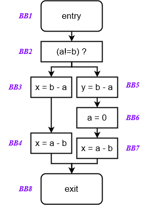
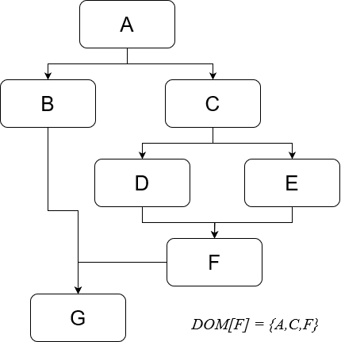
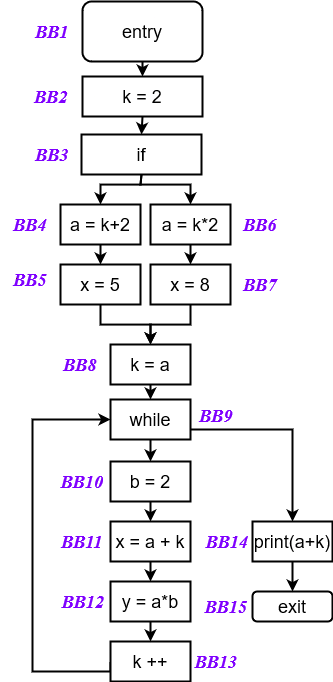

# Secondo assignment

## 1. Very Busy Expressions

      

<ul>
  <li>
    Un'espressione è very busy in un punto p se, indipendentemente dal percorso preso da p,
    l’espressione viene usata prima che uno dei suoi operandi venga definito.
  </li>
  <li>
    Un'espressione a+b è very busy in un punto p se a+b è valutata in tutti i percorsi da p a EXIT e non c’è una definizione di a o b lungo tali percorsi.
  </li>
  <li>
    Ci interessa l’insieme di espressioni disponibili (available) all'inizio del blocco B.
  </li>
  <li>
    L'insieme dipende dai percorsi che cominciano al punto p prima di B.
  </li>
</ul>

 

        <!-- Tabella a sinistra -->
 

<table border="2" style="height: 10px;">    <thead>
        <tr>
            <th>Domain</th>
            <th>Insiemi di espressioni</th>
        </tr>
    </thead>
    <tbody>
        <tr>
            <td>Direction</td>
            <td>Backward</td>
        </tr>
        <tr>
            <td></td>
            <td><em>IN[b] = fb (OUT[b])</em></td>
        </tr>
        <tr>
            <td></td>
            <td><em>OUT[b] = ^IN[successori(b)]</em></td>
        </tr>
        <tr>
            <td>Transfer function</td>
            <td><em>fb(x) = Genb ∪ (x - Killsb)</em></td>
        </tr>
        <tr>
            <td>Meet Operation</td>
            <td><em>∩</em></td>
        </tr>
        <tr>
            <td>Boundary Condition</td>
            <td><em>IN[exit] = &emptyset;</em></td>
        </tr>
        <tr>
            <td>Initial interior points</td>
            <td><em>In[b] = μ</td>
        </tr>
    </tbody>
</table>

> Utilizziamo un approccio **backward**, proprio come quanto visto nella **liveness analysis**, perché se un espressione è very busy *dopo* un istruzione e non viene aggiornata da quella stessa istruzione, allora l'espressione sarà very busy anche **prima** dell'istruzione.
> 
> Da questo capiamo che l'informazione si propaga **all'indietro**.
> 
> Partiamo quindi dai punti di uscita (exit) fino ai punti di ingresso (entry).
> 
> > Il bit vector utilizzato include le espressioni b-a e a-b.
> > 
> > Per comprendere la tabella delle iterazioni è importante notare che la il primo bit è associato all'espressione `b-a` mentre il secondo all'espressione `a-b`. 
> > Ad esempio, la coppia (1,1) indica che in quella configurazione specifica i bit corrispondenti alle espressioni `b-a` ed `a-b` sono attivi.

    <table border="2">
<caption >Tabella Gen e Kill</caption>
<thead>
    <tr>
      <th><strong>BB</strong></th>
      <th><strong>Gen</strong></th>
      <th><strong>Kill</strong></th>
    </tr>
  </thead>
  <tbody>
    <tr>
      <td>1</td>
      <td>∅</td>
      <td>∅</td>
    </tr>
    <tr>
      <td>2</td>
      <td>∅</td>
      <td>∅</td>
    </tr>
    <tr>
      <td>3</td>
      <td><em>b-a</em></td>
      <td>∅</td>
    </tr>
    <tr>
      <td>4</td>
      <td><em>a-b</em></td>
      <td>∅</td>
    </tr>
    <tr>
      <td>5</td>
      <td><em>b-a</em></td>
      <td>∅</td>
    </tr>
    <tr>
      <td>6</td>
      <td>∅</td>
      <td><em>b-a</em>, <em>a-b</em></td>
    </tr>
    <tr>
      <td>7</td>
      <td><em>a-b</em></td>
      <td>∅</td>
    </tr>
    <tr>
      <td>8</td>
      <td>∅</td>
      <td>∅</td>
    </tr>
  </tbody>
</table>

<table border="2">
    <caption>Iterazioni</caption>
    <thead>
        <tr>
            <th>BB</th>
            <th colspan="2">Iterazione 1</th>
            <th colspan="2">Iterazione 2</th>
            <th colspan="2">Iterazione 3</th>
        </tr>
    </thead>
    <tbody>
        <tr>
            <td> </td>
            <td>in</td>
            <td>out</td>
            <td>in</td>
            <td>out</td>
            <td>in</td>
            <td>out</td>
        </tr>
        <tr>
            <td>BB1</td>
            <td>1,1</td>
            <td>1,1</td>
            <td>1,0</td>
            <td>1,0</td>
            <td>1,0</td>
            <td>1,0</td>
        </tr>
        <tr>
            <td>BB2</td>
            <td>1,1</td>
            <td>1,1</td>
            <td>1,0</td>
            <td>1,0</td>
            <td>1,0</td>
            <td>1,0</td>
        </tr>
        <tr>
            <td>BB3</td>
            <td>1,1</td>
            <td>1,1</td>
            <td>1,1</td>
            <td>0,1</td>
            <td>1,1</td>
            <td>0,1</td>
        </tr>
        <tr>
            <td>BB4</td>
            <td>1,1</td>
            <td>∅</td>
            <td>0,1</td>
            <td>∅</td>
            <td>0,1</td>
            <td>∅</td>
        </tr>
        <tr>
            <td>BB5</td>
            <td>1,1</td>
            <td>1,1</td>
            <td>1,0</td>
            <td>0,0</td>
            <td>1,0</td>
            <td>0,0</td>
        </tr>
        <tr>
            <td>BB6</td>
            <td>1,1</td>
            <td>1,1</td>
            <td>0,0</td>
            <td>0,1</td>
            <td>0,0</td>
            <td>0,1</td>
        </tr>
        <tr>
            <td>BB7</td>
            <td>1,1</td>
            <td>∅</td>
            <td>0,1</td>
            <td>∅</td>
            <td>0,1</td>
            <td>∅</td>
        </tr>
        <tr>
            <td>BB8</td>
            <td>∅</td>
            <td>0,0</td>
            <td>∅</td>
            <td>∅</td>
            <td>∅</td>
            <td>∅</td>
        </tr>
    </tbody>
</table>
 
 
 
 
 
 
 
 
 
 
 
 
 
 
 
 
 
 
 
 
 
 

---

## 2. Dominator Analysis

       

<ul>
  <li>
    In un CFG diciamo che un nodo X domina un altro nodo Y se il nodo X appare in ogni percorso del grafo che porta dal blocco ENTRY al blocco Y.
  </li>
  <li>
    Annotiamo ogni basic block Bi con un insieme DOM[Bi].
  </li>
  <li>
    Bi appartiene a DOM[Bj] se e solo se Bi domina Bj.</li>
  <li>
    Per definizione, un nodo domina se stesso.  </li>
    <li>Bi appartiene a DOM[Bi].</li>
</ul>

 

        <!-- Tabella a sinistra -->
 

<table border = 2>
    <thead>
        <tr>
            <th>Domain</th>
            <th>Insiemi di espressioni</th>
        </tr>
    </thead>
    <tbody>
        <tr>
            <td>Direction</td>
            <td>Forward</td>
        </tr>
        <tr>
            <td></td>
            <td><em>OUT[b] = fb (IN[b])</em></td></td>
        </tr>
        <tr>
            <td></td>
            <td><em>IN[b] = ^OUT[predecessori(b)]</em></td>
        </tr>
        <tr>
            <td>Transfer function</td>
            <td><em>fb(x) = B ∪ x</em></td>
        </tr>
        <tr>
            <td>Meet Operation</td>
            <td><em>∩</em></td>
        </tr>
        <tr>
            <td>Boundary Condition</td>
            <td><em>IN[exit] = entry</em></td>
        </tr>
        <tr>
            <td>Initial interior points</td>
            <td><em>In[b] = μ</td>
        </tr>
    </tbody>
</table>

> Non troviamo funzioni Gen e Kill poiché stiamo lavorando direttamente con dei basic block. L'intersezione è l'operazione che riflette meglio questa proprietà di inclusione. Quando calcoliamo l'OUT di un basic block b, consideriamo l'intersezione degli IN dei suoi predecessori. Questo significa che l'OUT[b] deve contenere solo quei blocchi che sono dominatori comuni di tutti i predecessori di b. L'intersezione riduce l'insieme di possibili dominatori, mantenendo solo quei blocchi che sono dominatori comuni a tutti i percorsi di ingresso nel blocco.

<table border="2">
    <caption>Iterazioni</caption>
    <thead>
        <tr>
            <th>BB</th>
            <th colspan="2">Iterazione 1</th>
            <th colspan="2">Iterazione 2</th>
            <th colspan="2">Iterazione 3</th>
        </tr>
    </thead>
    <tbody>
        <tr>
            <td> </td>
            <td>in</td>
            <td>out</td>
            <td>in</td>
            <td>out</td>
            <td>in</td>
            <td>out</td>
        </tr>
        <tr>
            <td>A</td>
            <td>A</td>
            <td>A</td>
            <td>A</td>
            <td>A</td>
            <td>A</td>
            <td>A</td>
        </tr>
        <tr>
            <td>B</td>
            <td>A</td>
            <td>B</td>
            <td>A</td>
            <td>AB</td>
            <td>A</td>
            <td>AB</td>
        </tr>
        <tr>
            <td>C</td>
            <td>AC</td>
            <td>C</td>
            <td>A</td>
            <td>AC</td>
            <td>A</td>
            <td>AC</td>
        </tr>
        <tr>
            <td>D</td>
            <td>AC</td>
            <td>D</td>
            <td>AC</td>
            <td>ACD</td>
            <td>AC</td>
            <td>ACD</td>
        </tr>
        <tr>
            <td>E</td>
            <td>AC</td>
            <td>E</td>
            <td>AC</td>
            <td>ACE</td>
            <td>AC</td>
            <td>ACE</td>
        </tr>
        <tr>
            <td>F</td>
            <td>∅</td>
            <td>F</td>
            <td>AC</td>
            <td>ACF</td>
            <td>AC</td>
            <td>ACF</td>
        </tr>
        <tr>
            <td>G</td>
            <td>∅</td>
            <td>G</td>
            <td>A</td>
            <td>AG</td>
            <td>A</td>
            <td>AG</td>
        </tr>
    </tbody>
</table>
 
 

---

## 3. Constant Propagation

       

<ul>
  <li>
   L’obiettivo della constant propagation è quello di determinare in quali punti del programma le variabili hanno un valore costante.
    </li>
  <li>
    L’informazione da calcolare per ogni nodo n del CFG è un insieme di coppie del tipo <variabile, valore costante>.
  </li>
  <li>
    Se abbiamo la coppia <x, c> al nodo n, significa che x è garantito avere il valore c ogni volta che n viene raggiunto durante l’esecuzione del programma.
  </li>
</ul>

     

        <!-- Tabella a sinistra -->
        
    

<!-- Tabella Constant Propagation -->
<table border="2">
    <thead>
        <tr>
            <th colspan="2"><strong>Constant Propagation</strong></th>
        </tr>
    </thead>
    <tbody>
        <tr>
            <td>Domain</td>
            <td>Insiemi di coppie <em>(variabile, costante)</em></td>
        </tr>
        <tr>
            <td>Direction</td>
            <td>Forward</td>
        </tr>
        <tr>
            <td></td>
            <td>OUT[b] = fb (IN[b])</td>
        </tr>
        <tr>
            <td></td>
            <td>IN[b] = ^ OUT[predecessori(b)]</td>
        </tr>
        <tr>
            <td>Transfer function</td>
            <td>fb(x) = Genb ∪ (x - Killsb)</td>
        </tr>
        <tr>
            <td>Meet Operation</td>
            <td>∩</td>
        </tr>
        <tr>
            <td>Boundary Condition</td>
            <td>OUT[entry] = &emptyset;</td>
        </tr>
        <tr>
            <td>Initial interior points</td>
            <td>OUT[b_i] = μ</td>
        </tr>
    </tbody>
</table>

<!-- Tabella Gen e Kill -->

> Nell'ottimizzazione della propagazione delle costanti, l'obiettivo principale è determinare quali valori costanti possono essere riconosciuti prima di eseguire ogni blocco di base del programma. L'analisi in avanti si allinea naturalmente con il flusso di esecuzione del programma, dove le variabili e i valori vengono definiti prima di essere utilizzati. Nell'analisi in avanti, i risultati per ciascun blocco di base dipendono dagli ingressi provenienti dai blocchi predecessori.

    <table border="2">
    <caption>Iterazioni</caption>
        <thead>
            <tr>
                <th>BB</th>
                <th colspan="2">Iterazione 1</th>
                <th colspan="2">Iterazione 2</th>
                <th colspan="2">Iterazione 3</th>
                <th colspan="2">Iterazione 4</th>
            </tr>
            <tr>
                <th> </th>
                <th>in</th>
                <th>out</th>
                <th>in</th>
                <th>out</th>
                <th>in</th>
                <th>out</th>
                <th>in</th>
                <th>out</th>
            </tr>
        </thead>
        <tbody>
            <tr>
                <td>Entry</td>
                <td>∅</td>
                <td>μ</td>
                <td>∅</td>
                <td>∅</td>
                <td>∅</td>
                <td>∅</td>
                <td>∅</td>
                <td>∅</td>
            </tr>
            <tr>
                <td>1</td>
                <td>μ</td>
                <td>μ</td>
                <td>∅</td>
                <td>(k,2)</td>
                <td>∅</td>
                <td>(k,2)</td>
                <td>∅</td>
                <td>(k,2)</td>
            </tr>
            <tr>
                <td>2</td>
                <td>μ</td>
                <td>μ</td>
                <td>(k,2)</td>
                <td>(k,2)</td>
                <td>(k,2)</td>
                <td>(k,2)</td>
                <td>(k,2)</td>
                <td>(k,2)</td>
            </tr>
            <tr>
                <td>3</td>
                <td>μ</td>
                <td>μ</td>
                <td>(k,2)</td>
                <td>(k,2)(a,4)</td>
                <td>(k,2)</td>
                <td>(k,2)(a,4)</td>
                <td>(k,2)</td>
                <td>(k,2)(a,4)</td>
            </tr>
            <tr>
    <td>4</td>
    <td>μ</td>
    <td>μ</td>
    <td>(k,2)(a,4)</td>
    <td>(k,2)(a,4) (x,5)</td>
    <td>(k,2)(a,4)</td>
    <td>(k,2)(a,4) (x,5)</td>
    <td>(k,2)(a,4)</td>
    <td>(k,2)(a,4) (x,5)</td>
</tr>
<tr>
    <td>5</td>
    <td>μ</td>
    <td>μ</td>
    <td>(k,2)</td>
    <td>(k,2)(a,4)</td>
    <td>(k,2)</td>
    <td>(k,2)(a,4)</td>
    <td>(k,2)</td>
    <td>(k,2)(a,4)</td>
</tr>
<tr>
    <td>6</td>
    <td>μ</td>
    <td>μ</td>
    <td>(k,2)(a,4)</td>
    <td>(k,2)(a,4) (x,8)</td>
    <td>(k,2)(a,4)</td>
    <td>(k,2)(a,4) (x,8)</td>
    <td>(k,2)(a,4)</td>
    <td>(k,2)(a,4) (x,8)</td>
</tr>
<tr>
    <td>7</td>
    <td>μ</td>
    <td>μ</td>
    <td>(k,2)(a,4)</td>
    <td>(k,2)(a,4)</td>
    <td>(k,2)(a,4)</td>
    <td>(k,2)(a,4)</td>
    <td>(k,2)(a,4)</td>
    <td>(k,2)(a,4)</td>
</tr>
<tr>
    <td>8</td>
    <td>μ</td>
    <td>μ</td>
    <td>(k,2)(a,4)</td>
    <td>(k,2)(a,4)</td>
    <td>(a,4)</td>
    <td>(a,4)</td>
    <td>(a,4)</td>
    <td>(a,4)</td>
</tr>
<tr>
    <td>9</td>
    <td>μ</td>
    <td>μ</td>
    <td>(k,2)(a,4)</td>
    <td>(b,2)(k,2)(a,4)</td>
    <td>(a,4)</td>
    <td>(a,4)(b,2)</td>
    <td>(a,4)</td>
    <td>(a,4)(b,2)</td>
</tr>
<tr>
    <td>10</td>
    <td>μ</td>
    <td>μ</td>
    <td>(b,2)(k,4)(a,4)</td>
    <td>(b,2)(k,4)(a,4)(x,8)</td>
    <td>(a,4)(b,2)</td>
    <td>(a,4)(b,2)</td>
    <td>(a,4)(b,2)</td>
    <td>(a,4)(b,2)</td>
</tr>
<tr>
    <td>11</td>
    <td>μ</td>
    <td>μ</td>
    <td>(b,2)(k,4)(a,4)(x,8)</td>
    <td>(b,2)(k,4)(a,4)(x,8)(y,8)</td>
    <td>(a,4)(b,2)</td>
    <td>(a,4)(b,2)(y,8)</td>
    <td>(a,4)(b,2)</td>
    <td>(a,4)(b,2)(y,8)</td>
</tr>
<tr>
    <td>12</td>
    <td>μ</td>
    <td>μ</td>
    <td>(b,2)(k,4)(a,4)(x,8)(y,8)</td>
    <td>(b,2)(a,4)(x,8)(y,8)(k,5)</td>
    <td>(a,4)(b,2)(y,8)</td>
    <td>(a,4)(b,2)(y,8)</td>
    <td>(a,4)(b,2)(y,8)</td>
    <td>(a,4)(b,2)(y,8)</td>
</tr>
<tr>
    <td>13</td>
    <td>μ</td>
    <td>μ</td>
    <td>(k,4)(a,4)</td>
    <td>(k,4)(a,4)</td>
    <td>(a,4)</td>
    <td>(a,4)</td>
    <td>(a,4)</td>
    <td>(a,4)</td>
</tr>
<tr>
    <td>Exit</td>
    <td>μ</td>
    <td>μ</td>
    <td>(k,4)(a,4)</td>
    <td>(k,4)(a,4)</td>
    <td>(a,4)</td>
    <td>(a,4)</td>
    <td>(a,4)</td>
    <td>(a,4)</td>
</tr>
